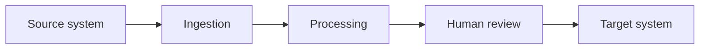

# Technical PRD — {{COMPANY}} AI Program

**Version** 1.0 · **Date** {{DATE}} · **Author** {{AUTHOR}} · **Status** Draft for eng review

## 1. Context

Business, industry, relevant constraints. Two paragraphs. Include current tech stack and
anything that hard-constrains architecture (on-prem only, no vendor data sharing, etc.).

## 2. Scope

**In scope:** OPP-01, OPP-03 (approved {{DATE}})
**Out of scope:** explicitly list what was considered and deferred, with reason.

## 3. Non-negotiable constraints

| Constraint | Source | Architectural implication |
|---|---|---|
| e.g. PHI cannot leave client VPC | HIPAA | self-hosted inference or BAA-covered vendor only |

---

## OPP-01 — {{NAME}}

### 3.1 Problem statement
What is broken, measured. Not the solution.

### 3.2 System context

### 3.3 Recommended architecture
Pattern name and why. Component-by-component: ingestion, storage, model layer, orchestration,
review interface, output integration.

### 3.4 Alternative considered
| Option | Pro | Con | Why not chosen |
|---|---|---|---|
| Off-the-shelf vendor X | | | |
| Do nothing | zero cost | ongoing $N/yr burn | |

### 3.5 Data
| Dataset | Source system | Volume | Format | Quality issues | Access path |
|---|---|---|---|---|---|

Preprocessing required. PII fields and handling. Retention policy.

### 3.6 Model and tooling
Model class and candidate models, with rationale. Estimated tokens or inference calls per
transaction. Cost per transaction × projected monthly volume × 3 headroom.

### 3.7 Evaluation plan
**Define before building.**

| Metric | Definition | Baseline (human) | Launch gate | Target @ 6mo |
|---|---|---|---|---|

Test set: size, how labeled, who owns it. Regression suite cadence. Online metrics and how
they're instrumented.

### 3.8 Human-in-the-loop
What a person reviews, the interface, the SLA, and the criteria under which the review gate
narrows over time (e.g. auto-approve above confidence 0.9 after 500 clean reviews).

### 3.9 Guardrails and failure modes
| Failure mode | Detection | Mitigation | Fallback |
|---|---|---|---|

### 3.10 Security and compliance
Auth model, secret management, data residency, audit logging, vendor DPAs, training opt-out.

### 3.11 Integration points
| System | Direction | Method | Auth | Owner |
|---|---|---|---|---|

---

## 4. Delivery roadmap

| Phase | Weeks | Deliverable | Exit criteria | Dependencies |
|---|---|---|---|---|
| 0 Discovery | 1-2 | data audit, labeled eval set | eval harness runs | client data access |
| 1 Prototype | 3-6 | offline pipeline hitting launch gate | metric ≥ gate | phase 0 |
| 2 Pilot | 7-10 | production, one team, HITL on everything | N clean weeks | integrations live |
| 3 Rollout | 11-16 | full deployment, relaxed gates | adoption ≥ target | pilot sign-off |

## 5. Team and effort
| Role | Allocation | Phases |
|---|---|---|

## 6. Cost model
| Line item | One-time | Monthly |
|---|---|---|
| Build | | |
| Inference | | |
| Infra | | |
| Maintenance | | |

## 7. Open technical questions
Numbered, each with an owner and a date needed by.
